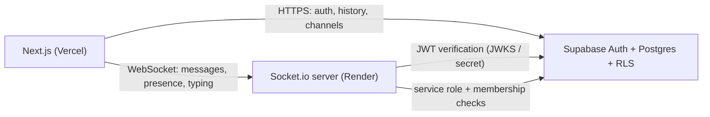

# Slack Lite

A Slack-like real-time chat MVP built to demonstrate networking fundamentals, secure authentication, and professional SDLC practices.

Repository: https://github.com/sudais-khan12/slack-lite

## Architecture



## Monorepo layout

- `apps/web` — Next.js 15, Tailwind, shadcn-style UI, Supabase SSR sessions
- `apps/server` — Express + Socket.io, JWT handshake auth, presence + typing
- `packages/shared` — typed socket events and Zod payload schemas
- `supabase/migrations` — Postgres schema, RLS, RPC helpers

## Why WebSockets (TCP) vs HTTP/REST vs UDP

| Concern | Choice | Reason |
|--------|--------|--------|
| Sign up / login / history / channel list | HTTPS + Supabase (REST/RPC) | Request/response, cacheable, no persistent connection needed |
| Live messages, typing, presence | WebSockets (Socket.io over TCP) | Server-initiated pushes; avoids polling latency and load |
| UDP | Not used | UDP is connectionless and may drop/reorder packets — fine for live media, poor fit for ordered chat delivery |

Socket.io runs on a long-lived TCP connection (upgraded from HTTP). That gives ordered, reliable delivery appropriate for chat.

## Local development

### Prerequisites

- Node.js 24+
- A Supabase project with migrations applied (see `supabase/migrations/`)
- Service role key and JWT secret from Supabase dashboard (server only — never commit)

### Setup

```bash
cd slack-lite
npm install
cp apps/web/.env.example apps/web/.env.local
cp apps/server/.env.example apps/server/.env
```

Fill in:

- **Web** (`apps/web/.env.local`): `NEXT_PUBLIC_SUPABASE_URL`, `NEXT_PUBLIC_SUPABASE_ANON_KEY`, `NEXT_PUBLIC_SOCKET_URL=http://localhost:4000`
- **Server** (`apps/server/.env`): `SUPABASE_URL`, `SUPABASE_SERVICE_ROLE_KEY`, optional `SUPABASE_JWT_SECRET`, `CLIENT_ORIGIN=http://localhost:3000`

Apply SQL migrations via Supabase SQL editor or CLI, in order:

1. `supabase/migrations/20260326120000_init.sql`
2. `supabase/migrations/20260326130000_channel_discovery.sql`

### Run

```bash
npm run build -w @slack-lite/shared
npm run dev:server   # terminal 1 — port 4000
npm run dev:web      # terminal 2 — port 3000
```

## Security notes

- No secrets in git; use `.env` files locally and host env vars in production.
- Browser only receives the Supabase **anon** key and socket URL.
- Socket server uses the **service role** key only on the backend and re-checks channel membership on every `message:send`.
- Row Level Security limits reads/writes to conversation members.

## Deployment

### Render (Socket.io server)

1. Connect this repo to Render.
2. Use `render.yaml` or create a Web Service with root directory `apps/server`.
3. Set env vars: `SUPABASE_URL`, `SUPABASE_SERVICE_ROLE_KEY`, `SUPABASE_JWT_SECRET` (if using HS256), `CLIENT_ORIGIN` (your Vercel URL).

### Vercel (Next.js)

1. Import the repo; set root to `apps/web` or use monorepo settings.
2. Set `NEXT_PUBLIC_SUPABASE_URL`, `NEXT_PUBLIC_SUPABASE_ANON_KEY`, `NEXT_PUBLIC_SOCKET_URL` (Render service URL).

Free tiers may sleep when idle; first WebSocket connect after sleep can take a few seconds.

## SDLC

- GitHub Issues track features (auth, sockets, UI, deploy).
- Feature branches + conventional commits + PRs with `Closes #N`.
- CI (`.github/workflows/ci.yml`) runs typecheck and lint on push/PR.

## Interview talking points

1. **Sessions / JWT**: Supabase issues JWT access tokens; the web app stores them in HTTP-only cookies via `@supabase/ssr`. The socket server validates the same JWT on handshake (JWKS or shared secret).
2. **Authorization**: RLS in Postgres + server-side membership checks before broadcasting.
3. **Presence**: In-memory map on a single server instance; multi-instance would need the Socket.io Redis adapter.
